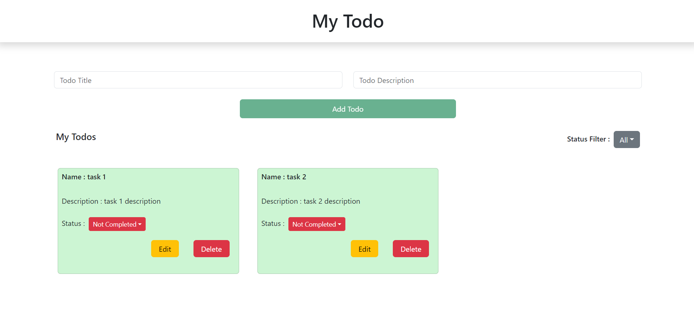

## React Todo Task

> Creating a Todo App with all CRUD (`Create` - `Read` - `Update` - `Delete`) functionalities.

- Created a todo app with Name, Description & Status.

- On adding a todo task it make a todo card with default status as `Not Completed`.

- In the card there will be a drop down menu to change status as `Completed` or `Not Completed`.

- There will be two buttons named `Edit` to edit/update the card details & `Delete` to delete the card.

- `Status Filter` dropdown menu will help to filter the card by its status with `All` as default and can view by either `Completed` or `Not Completed`

- [Click here]() to preview the deployed webpage.
 